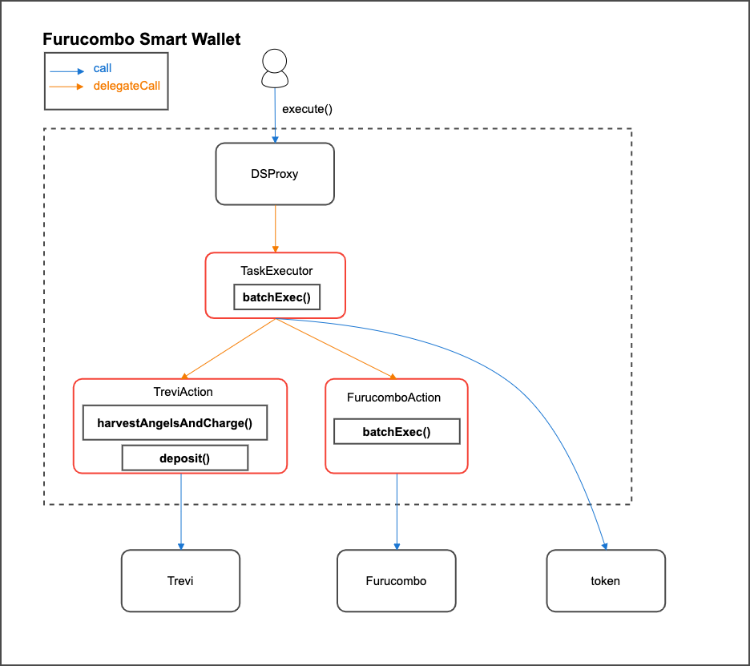

# Furucombo-Smart-Wallet

## Overview

Furucombo-Smart-Wallet is a wallet system to help users easily manage their assets. Users can interact with multiple contracts in a single transaction, easy to manage wallet authority, and execute automation tasks. Furucombo-Smart-Wallet makes up of three parts, **DSProxy**, **Task Executor**, and **Action**. Users can hold their assets in DSProxy and execute operations through Task Executor and Action.

## Description

Furucombo-Smart-Wallet contracts contain two different parts, **Task Executor** and **Action**.

### Task Executor

Task Executor is a multi-call architecture system, and it can execute multi-operations in a single transaction. In Task Executor, there are two call types of operation, `CallWithValue` and `DelegateCall`. It can interact with contracts directly through `CallWithValue` or delegate-call specific actions through `DelegateCall`. In addition, operation parameters may apply to the execution result. For the details, please refer to the [Chained Input guideline](CHAINEDINPUT.md).

### Action

Action is the contract delegate call by Task Executor for the specific contracts or specific operations. Action contracts are in `contracts/actions` folder with `A` prefix on filename.

## 

---

## Installation

```console
$ npm install
```

---

## Test

The testing is performed through the fork function of [ganache-cli](https://github.com/trufflesuite/ganache-cli). The location of the data source is defined under `$POLYGON_MAINNET_NODE`. You may perform the testing by your own polygon mainnet node instance or service provider like [Infura](https://infura.io/).

```console
$ export POLYGON_MAINNET_NODE=https://polygon-mainnet.infura.io/v3/{Your_project_ID}
$ npm run test
```

or

```console
$ POLYGON_MAINNET_NODE=https://polygon-mainnet.infura.io/v3/{Your_project_ID} npm run test
```

---

## License

Furu-DSProxy is released under the [MIT License](LICENSE).
